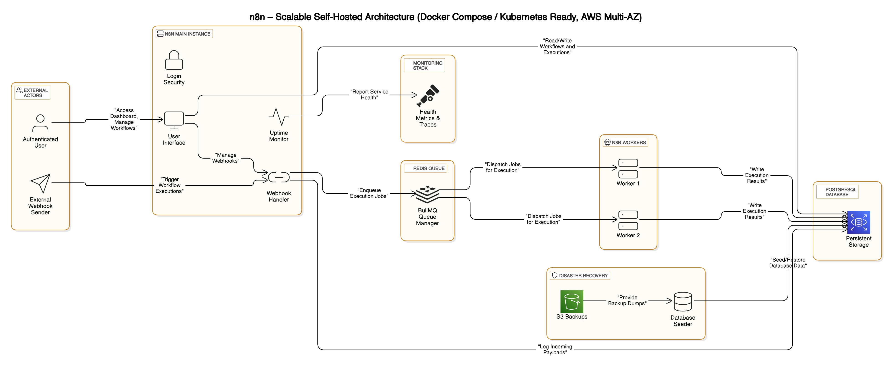

# 📈 n8n-Scaling — Self-Hosted, Scalable n8n Architecture

A fully **self-hosted**, **scalable**, and **Docker Compose/Kubernetes-ready** n8n stack, built for serious production environments.  
Separate **UI**, **Webhook handling**, and **Workers** for **true horizontal scalability** across instances or clusters.  
Optimized for **AWS EKS / GKE / AKS** deployments, and **multi-region failover**.

---

# 📑 Table of Contents
- [📈 n8n-Scaling — Self-Hosted, Scalable n8n Architecture](#-n8n-scaling--self-hosted-scalable-n8n-architecture)
- [📜 Architecture Overview](#-architecture-overview)
- [🚀 Key Features](#-key-features)
- [🛠️ Setup Instructions](#️-setup-instructions)
- [🔧 Configuration Variables (.env)](#-configuration-variables-env)
- [💾 Database Seeding](#-database-seeding)
- [🔭 Future Improvements](#-future-improvements)
- [📎 Useful Resources](#-useful-resources)
- [🌟 About](#-about)
- [📢 License](#-license)

---

# 📜 Architecture Overview



**Highlights**:
- **Separate UI & Webhook Handling**  
- **Webhook execution scalable via Redis Queue (BullMQ)**
- **Multiple workers** can be spawned independently
- **Database seeder** ensures default users/workflows ready at first start
- **PostgreSQL** for executions, metadata, credentials
- **Redis** for queue management
- **Monitoring stack ready** (metrics endpoints, uptime)
- **Disaster Recovery hooks** (PostgreSQL backups to S3)

---

# 🚀 Key Features

✅ Docker Compose deployment — lightweight and production-hardened  
✅ Auto-database seeding for immediate multi-user environments  
✅ Separate Webhook Handler — true real-time, high-concurrency scaling  
✅ Worker scaling — just `docker compose up --scale n8n-worker=X`  
✅ Kubernetes (EKS, GKE, AKS) ready  
✅ Healthchecks & monitoring integrations  
✅ Disaster recovery via S3 storage and DB Seeder  
✅ Secure `.env` environment with tokenized auth & encryption  

---

# 🛠️ Setup Instructions

> 💬 **Clone the repo** and run:

```bash
git clone git@github.com:mustaphaibnel/n8n-scaling.git
cd n8n-scaling
cp .env.example .env
```

- Edit `.env` with your desired credentials.

Then simply:

```bash
docker compose --env-file .env up -d --build
```

✔️ That's it!  
UI available at:  
`http://localhost:5678`  

Default login credentials set from your `.env`.

---

# 🔧 Configuration Variables (.env)

| Variable | Description |
|:--------|:------------|
| `POSTGRES_USER` | Postgres database user |
| `POSTGRES_PASSWORD` | Postgres password |
| `POSTGRES_DB` | Postgres database name |
| `REDIS_HOST` | Redis hostname |
| `REDIS_PORT` | Redis port (default: 6379) |
| `N8N_ENCRYPTION_KEY` | Encryption key for workflows |
| `N8N_JWT_SECRET` | JWT signing key |
| `N8N_API_TOKEN` | API access token |
| `N8N_BASIC_AUTH_ACTIVE` | Enable/disable UI basic auth |
| `N8N_BASIC_AUTH_USER` | UI username |
| `N8N_BASIC_AUTH_PASSWORD` | UI password |
| `N8N_TAG` | n8n Docker image tag (default: 1.80.3) |

---

# 💾 Database Seeding

Database seeding happens automatically **before starting main services**.

Seeder details:
- **db-seeder** lightweight alpine container
- Waits for PostgreSQL and Redis to become healthy
- Loads the pre-configured `init/full-dump.sql`
- Ensures pre-created **users**, **projects**, and **settings**  

If you want to reseed manually:

```bash
docker exec -i postgres psql -U ${POSTGRES_USER} -d ${POSTGRES_DB} < ./init/full-dump.sql
```

---

# 🔭 Future Improvements

| Feature | Status |
|:--------|:-------|
| Kubernetes Manifests (EKS-ready) | 🚀 Planned |
| HA Redis Sentinel Deployment | 🚀 Planned |
| Dynamic scaling for webhook receiver (horizontal) | 🚀 Planned |
| Terraform AWS Infrastructure Scripts | 🚀 Planned |
| ArgoCD CI/CD Deployment Integration | 🚀 Planned |
| Full Disaster Recovery Playbooks | 🚀 Planned |

---

# 📎 Useful Resources

- [n8n Documentation](https://docs.n8n.io/)
- [PostgreSQL Documentation](https://www.postgresql.org/docs/)
- [Redis BullMQ Documentation](https://docs.bullmq.io/)
- [Docker Compose Docs](https://docs.docker.com/compose/)
- [AWS EKS Kubernetes](https://docs.aws.amazon.com/eks/latest/userguide/what-is-eks.html)

---

# 🌟 About

Built with ❤️ by [Mustapha Ibn Elfarchakh](https://github.com/mustaphaibnel) —  
Helping teams scale **n8n** from MVPs to **global-grade infrastructures**.

---

# 📢 License

This project is licensed under the **MIT License**.
# n8n-scaling
